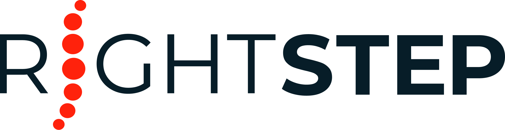

  

  

<h1 align="center">Nexus N3</h1>

  <strong>An open edge toolchain for sensor-driven research and operational solutions.</strong>

  Connect sensors, deploy algorithms and coordinate research and operational
  workflows across disconnected, distributed and mission-critical environments.

  <a href="https://nexus-n3.com/">Website</a>
  ·
  <a href="https://nexus-n3.com/gateway/">BLE Gateway</a>
  ·
  <a href="https://nexus-n3.com/gateway/docs/">Documentation</a>

---

## From research systems to operational solutions

Nexus N3 provides a common edge infrastructure and supporting toolchain for integrating sensors, configuring studies, executing algorithms, capturing multimodal data and coordinating operational workflows.

Research teams can use Nexus N3 to conduct repeatable sensor-driven studies, manage multi-sensor data collection, deploy processing algorithms and produce analysis-ready outputs.

Its modular architecture also enables organisations to build specialised solutions around their own sensors, algorithms and workflows, or to deploy supported Nexus N3 capabilities directly as operational tools.

The same core infrastructure therefore supports three closely related uses:

- conducting repeatable and reproducible sensor-driven research
- building specialised solutions around sensors, algorithms and workflows
- operating supported workflows directly in real-world environments

Nexus N3 is designed for environments where connectivity may be limited, infrastructure is distributed, data must remain close to where it is generated, or systems must continue operating independently of cloud services.

| **Sensor agnostic** | **Edge and offline first** |
| --- | --- |
| Integrate multiple sensor families and modalities through shared interfaces. | Execute workflows, process data and retain operational control locally. |

| **Modular by design** | **Operationally observable** |
| --- | --- |
| Add sensors, algorithms and applications without rebuilding the underlying system. | Monitor sensor connectivity, stream quality, processing and system health. |

## Open toolchain components

Nexus N3 provides open tools, interfaces and reference implementations that researchers, developers and organisations can use independently or as part of a wider Nexus N3 deployment.

| Project | Description |
| --- | --- |
| [**Nexus N3 BLE Tooling**](/Nexus-N3/rs-nexus-ble-tooling) | Python SDK, command-line clients and examples for the Nexus N3 BLE Gateway, supported sensor integrations, RF Survey and data-capture workflows. |
| [**Nexus N3 Plugin Tooling**](/Nexus-N3/rs-nexus-plugin-tooling) | Developer SDK and command-line tooling for creating, validating and packaging Nexus N3 sensor and algorithm plugins. |

The open toolchain enables researchers, developers and organisations to:

- integrate new sensors
- package and deploy algorithms
- build gateway and edge applications
- create study-specific and operational workflows
- validate hardware, connectivity and data capture
- contribute reusable integrations, plugins and tools

## Platform principles

- **Unify** sensors, algorithms, data and workflows through common infrastructure.
- **Research** using repeatable multi-sensor studies and reproducible data-processing workflows.
- **Build** specialised sensor-driven solutions using modular tools and interfaces.
- **Operate** supported workflows directly at the edge.
- **Extend** capabilities through sensors, algorithms, plugins and applications.
- **Control** deployments locally, remotely or through hybrid operating models.
- **Observe** connectivity, data flow, processing and system health.

## Application areas

Nexus N3 supports sensor-driven capabilities across:

- human health monitoring and physiology research
- health, performance and biomechanics studies
- space and analogue mission environments
- sensor, technology and algorithm validation
- distributed and remote research deployments
- operational monitoring and field data collection
- custom sensor-driven edge solutions

---

  Open tools for researching, building and operating sensor-driven edge systems.

  <a href="https://nexus-n3.com/"><strong>Explore Nexus N3 →</strong></a>

